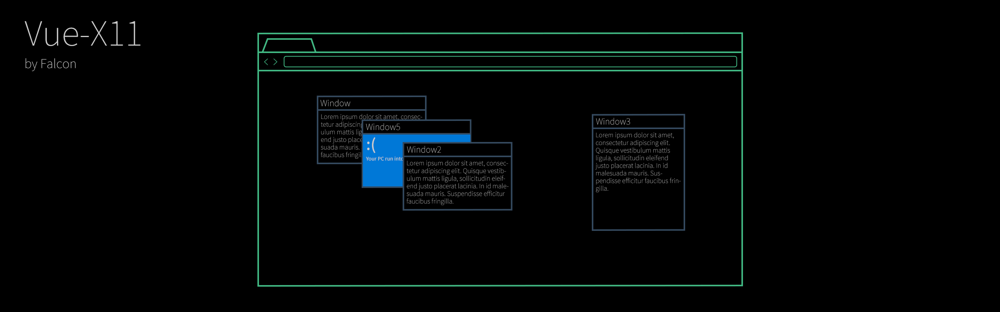

<p align="center"></p>

# Vue-x11
> Provides x11-like windowing system for Vue!

## About
Want to create a web-based application with fancy windowing system? Vue-x11 is your best choice! it a customizable window-like component designed for VueJS inspired by modern OS windowing systems.

## Preview
[Live demo](https://falconlee1011.github.io/vue-x11/demo)


## Features
- Window-like components.
- Auto sort [z-index](https://developer.mozilla.org/en-US/docs/Web/CSS/z-index) based on recent interaction of the windows.
- Come with ready-to use style.
- Customizable header with [slots](https://v2.vuejs.org/v2/guide/components-slots.html).

## Dependencies
- Please note that Vue 3 is NOT supported yet.

## How to
Install the plugin
```bash
npm install vue-xwindows
```

Vue.Use() in /src/main.js
```javascript
import Vue from 'vue';
import App from './App.vue';

import vueX11 from 'vue-x11'; // <-- add this

Vue.config.productionTip = false;

Vue.use(vueX11); // <-- and this

new Vue({
  render: h => h(App),
}).$mount('#app');
```

Here's a short example for this [live demo](https://falconlee1011.github.io/vue-x11/demo)
```html
<template>
  <div id="app">
    <XWindowManager>
      <XWindow
        v-for="i in 2" 
        :key="i" 
        :ref="`window-${i}`"
        :title="`Window${i}`"
        :default-y="`${20 * (i - 1)}%`"
        :default-x="`${20 * (i - 1)}%`"
        min-width="25%"
      >
        Lorem ipsum dolor sit amet
      </XWindow>
      <XWindow
        ref="window-3"
        :default-y="`${20 * 2}%`"
        :default-x="`${20 * 2}%`"
        min-width="25%"
        min-height="25%"
        :hide-default-header="true"
      >
        <template slot="header">
          <div class="custom-header">
            Window 3 with custom header
            <span class="actions" @click="minimizeWindow(3)"> MINIMIZE </span>
            <span class="actions" @click="closeWindow(3)"> CLOSE </span>
          </div>
        </template>
        Lorem ipsum dolor sit amet
      </XWindow>
    </XWindowManager>
  </div>
</template>

<script>

export default {
  name: 'App',
  methods: {
    minimizeWindow(i){
      this.$refs[`window-${i}`].toggleMinimize();
    }, 
    closeWindow(i){
      this.$refs[`window-${i}`].toggleVisibility();
    }, 
  },
}
</script>

<style>
body {
  font-family: Helvetica, sans-serif;
  color: #d7d7d7;
  background-color: #555;
  left: 0px;
  top: 0px;
  margin: 0;
}
.custom-header{
  background-color: #444;
  padding: .25rem;
  border-radius: 0.3rem 0.3rem 0 0;
  box-sizing: border-box;
  cursor: grab;
}
.custom-header .actions{
  float: right;
  margin: 0 0.5rem;
  box-sizing: border-box;
  height: 100%;
}
.custom-header .actions:hover{
  background: #333;
  cursor: pointer;
}
</style>
```

### Props of Window component
| Prop                  | Desrciption                                            | Type    | Default value |
| --------------------- | ------------------------------------------------------ | ------- | ------------- |
| allow-out-of-bound    | Allow/disallow window moving out of the browser window | Boolean | false         |
| title                 | Window title                                           | String  | "Window"      |
| hide-default-header   | Set to true to use slot to customize window header     | Boolean | false         |
| header-color          | Color of header text                                   | String  | null          |
| header-background     | Color of header background                             | String  | "#00000090"   |
| header-border-radius  | Header border radius                                   | String  | "0.25em"      |
| window-background     | Color of windows' background                           | String  | "#00000010"   |
| window-border-radius  | Window border radius                                   | String  | "0.25em"      |
| window-backdrop-blur  | Blurs backdround if window background has transparency | String  | "5px"         |
| default-y             | Default Y(width) position window will be placed        | String  | null          |
| default-x             | Default X(Height) position window will be placed       | String  | null          |
| min-width             | Windows' min width                                     | String  | null          |
| min-height            | Windows' min height                                    | String  | null          |
| width                 | Windows' width                                         | String  | "fit-content" |
| height                | Windows' height                                        | String  | "fit-content" |
| max-width             | Windows' max width                                     | String  | null          |
| max-height            | Windows' max height                                    | String  | null          |
| visibility-transition | Transition name when toggleVisibility() is called      | String  | "fade"        |
| minimize-transition   | Transition name when toggleMinimize() is called        | String  | "fade"        |

### Methods of Window component
```javascript
toggleVisibility()
```
- Toggling window's visibility (includes header).
```javascript
toggleMinimize()
```
- Toggling window content's visibility.

### Props of Window component
| Prop                  | Desrciption                                                            | Type    | Default value |
| --------------------- | ---------------------------------------------------------------------- | ------- | ------------- |
| auto-sort-z-index     | Auto sort windows' z-index based on recent interaction of the windows. | Boolean | true          |